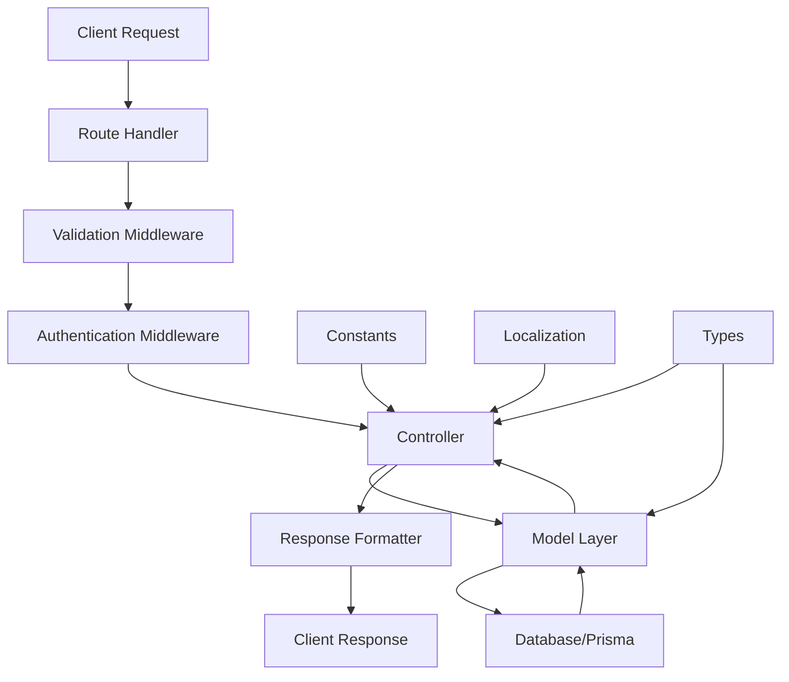

# API Architecture Documentation

## Overview

This document outlines the standardized architecture pattern used for building CRUD APIs in the management service. The detector API serves as the reference implementation for this pattern.

## Architecture Flow



## Directory Structure

```
src/
├── routes/
│   ├── admin/
│   ├── company/
│   │   └── detector.route.ts
│   └── index.ts
├── controllers/
│   ├── admin/
│   └── company/
│       └── detector.controller.ts
├── validation/
│   └── detector.validation.ts
├── models/
│   └── detector.model.ts
├── types/
│   └── model/
│       └── detector.model.ts
├── constant/
│   ├── index.ts
│   └── json/
│       ├── detector.json
│       ├── probe.json
│       └── category.json
├── locale/
│   ├── en.json
│   └── ar.json
├── middleware/
│   └── auth.middleware.ts
└── utils/
    ├── catchAsync.ts
    ├── customErrors.ts
    └── errorHandler.ts
```

## Component Details

### 1. Route Layer (`src/routes/company/detector.route.ts`)

**Purpose**: Define API endpoints and attach middleware

**Pattern**:

```typescript
import express, { RequestHandler, Router } from 'express';
import {
  controllerFunction1,
  controllerFunction2,
  validation,
} from '@/controllers/company/detector.controller';

const router: Router = express.Router();

// CRUD operations
router.post('/create', validation.createDetector, controllerFunction as RequestHandler);
router.put('/:id', validation.updateDetector, updateControllerFunction as RequestHandler);
router.delete('/:id', validation.deleteDetector, deleteControllerFunction as RequestHandler);

// List and utility operations
router.post('/list', validation.listDetectors, listControllerFunction as RequestHandler);
router.get('/dropdown', dropdownControllerFunction as RequestHandler);
router.get('/:id', validation.getDetector, getControllerFunction as RequestHandler);

export default router;
```

**Key Points**:

- Use `RequestHandler` type casting for TypeScript compatibility
- Order routes carefully (specific routes before parameterized ones)
- Group CRUD operations logically
- Export validation from controller for reusability

### 2. Controller Layer (`src/controllers/company/detector.controller.ts`)

**Purpose**: Handle HTTP requests, orchestrate business logic, format responses

**Pattern**:

```typescript
import constant from '@/constant';
import sendRes from '@/function/sendRes';
import validator from '@/function/validator';
import { modelFunction } from '@/models/detector.model';
import catchAsync from '@/utils/catchAsync';
import { AppError, isAppError } from '@/utils/customErrors';
import type { ValidationInterface } from '@/validation/detector.validation';
import { validationSchemas } from '@/validation/detector.validation';

// Export validation for route layer
export const validation: ValidationInterface = {
  createDetector: validator(createDetectorValidation),
  updateDetector: validator(updateDetectorValidation),
  // ... other validations
};

export const createDetectorController = catchAsync(async (req, res, next) => {
  const { field1, field2 } = req.body;
  const { user } = req;

  // Authentication check
  if (!user || !user.tenantId) {
    return next(AppError(constant.USER_NOT_FOUND(), constant.UNAUTHORIZED));
  }

  // Call model function
  const result = await modelFunction({
    field1,
    field2,
    tenantId: user.tenantId,
  });

  // Error handling
  if (isAppError(result)) return next(result);

  // Success response
  return sendRes({
    res,
    statusCode: constant.CREATED,
    message: constant.DATA_CREATED(constant.MODULE.DETECTOR()),
    data: result,
  });
});
```

**Key Points**:

- Use `catchAsync` wrapper for async error handling
- Always validate tenant context from `req.user.tenantId`
- Use `isAppError` for error detection
- Use constants for messages and status codes
- Export validation object for route layer

### 3. Validation Layer (`src/validation/detector.validation.ts`)

**Purpose**: Define request validation schemas using Joi

**Pattern**:

```typescript
import validator from '@/function/validator';
import type { ValidationSchema } from '@/types';
import { stringValidation } from '@/validation';
import { Joi } from 'express-validation';

export type ValidationInterface = {
  createDetector: ReturnType<typeof validator>;
  updateDetector: ReturnType<typeof validator>;
  deleteDetector: ReturnType<typeof validator>;
  getDetector: ReturnType<typeof validator>;
  listDetectors: ReturnType<typeof validator>;
};

export const createDetectorValidation: ValidationSchema = {
  body: Joi.object({
    detectorName: stringValidation,
    description: stringValidation.optional(),
    detectorType: stringValidation.valid('REGEX', 'HEURISTIC', 'PII'),
    confidence: Joi.number().min(0).max(1).required(),
    regex: Joi.array().items(stringValidation).allow(null).optional(),
  }),
};

export const updateDetectorValidation: ValidationSchema = {
  params: Joi.object({
    id: stringValidation,
  }),
  body: Joi.object({
    detectorName: stringValidation.optional(),
    description: stringValidation.optional(),
    // ... make all fields optional for updates
  }),
};

export const listDetectorsValidation: ValidationSchema = {
  query: Joi.object({
    page: stringValidation.optional(),
    limit: stringValidation.optional(),
  }),
  body: Joi.object({
    search: stringValidation.optional(),
    field: stringValidation.optional(),
    sort: stringValidation.optional(),
    // ... filter fields
  }),
};
```

**Key Points**:

- Export TypeScript interface for validation functions
- Use `stringValidation` from base validation
- Separate `params`, `query`, and `body` validation
- Make update fields optional
- Use `.valid()` for enum validation

### 4. Model Layer (`src/models/detector.model.ts`)

**Purpose**: Business logic, database operations, data transformation

**Pattern**:

```typescript
import { TenantPrismaClient } from '@/config/prisma';
import { CreateDetector, UpdateDetector } from '@/types/model/detector.model';
import { AppError } from '@/utils/customErrors';

export const createDetector: CreateDetector = async (params) => {
  const { tenantId } = params;
  const tenantPrisma = TenantPrismaClient.getClient(tenantId);

  try {
    // Business logic validation
    const existingDetector = await tenantPrisma.detectors.findUnique({
      where: { detectorName: params.detectorName },
    });

    if (existingDetector) {
      return AppError('Detector with this name already exists', 409);
    }

    // Database operation
    return await tenantPrisma.detectors.create({
      data: {
        detectorName: params.detectorName,
        description: params.description || null,
        creationType: 'External',
        detectorType: params.detectorType as DetectorType,
        confidence: params.confidence,
        regex: params.regex || null,
      },
    });
  } catch (error) {
    // Handle specific database errors
    if (error.code === 'P2010' && error.meta?.code === '42703') {
      // Auto-migration logic
      await TenantPrismaClient.migrateTenantSchema(tenantId);
      // Retry operation
      return await tenantPrisma.detectors.create({...});
    }
    return AppError('Failed to create detector', 500);
  }
};
```

**Key Points**:

- Use tenant-specific Prisma client
- Implement business logic validation
- Return `AppError` for error cases
- Handle database-specific errors
- Include auto-migration for schema issues
- Use proper TypeScript types from generated Prisma client

### 5. Types Layer (`src/types/model/detector.model.ts`)

**Purpose**: Define TypeScript interfaces for model functions

**Pattern**:

```typescript
import { IAppError } from '@/types';

export type CreateDetector = (params: {
  detectorName: string;
  description?: string;
  detectorType: string;
  confidence: number;
  regex?: string[];
  tenantId: string;
}) => Promise<import('@/generated').Detectors | IAppError>;

export type ListDetectors = (params: {
  page: number;
  limit: number;
  search?: string;
  field?: string;
  sort?: string;
  creationType?: string;
  detectorType?: string;
  startDate?: string;
  endDate?: string;
  dateField?: string;
  sortBy?: string;
  tenantId: string;
}) => Promise<
  | {
      docs: import('@/generated').Detectors[];
      pagination: { page: number; limit: number; totalDocs: number; totalPages: number };
    }
  | IAppError
>;
```

**Key Points**:

- Always include `tenantId: string` parameter
- Use union types with `IAppError` for error handling
- Import Prisma types from generated client
- Define pagination structure for list operations
- Use optional parameters appropriately

### 6. Constants Layer (`src/constant/index.ts`)

**Purpose**: Centralized constants and localized messages

**Pattern**:

```typescript
import il8n from '@/function/il8n';

const HTTP_RESPONSE = {
  SUCCESS: 200,
  CREATED: 201,
  BAD_REQUEST: 400,
  UNAUTHORIZED: 401,
  FORBIDDEN: 403,
  NOT_FOUND: 404,
  CONFLICT: 409,
  INTERNAL_SERVER_ERROR: 500,
} as const;

const DATA = {
  DATA_CREATED: (Data: string): string => il8n.t('DATA.DATA_CREATED', { Data }),
  DATA_UPDATED: (Data: string): string => il8n.t('DATA.DATA_UPDATED', { Data }),
  DATA_DELETED: (Data: string): string => il8n.t('DATA.DATA_DELETED', { Data }),
  DATA_NOT_FOUND: (Data: string): string => il8n.t('DATA.DATA_NOT_FOUND', { Data }),
  DATA_RETRIEVED: (Data: string): string => il8n.t('DATA.DATA_RETRIEVED', { Data }),
} as const;

const MODULE = {
  PROFILE: () => il8n.t('MODULE.PROFILE'),
  COMPANY: () => il8n.t('MODULE.COMPANY'),
  DETECTOR: () => il8n.t('MODULE.DETECTOR'),
} as const;
```

### 7. Localization Layer (`src/locale/en.json`)

**Purpose**: Internationalization support

**Pattern**:

```json
{
  "DATA": {
    "DATA_CREATED": "{{Data}} created successfully!",
    "DATA_UPDATED": "{{Data}} updated successfully!",
    "DATA_DELETED": "{{Data}} deleted successfully!",
    "DATA_NOT_FOUND": "{{Data}} not found",
    "DATA_RETRIEVED": "{{Data}} retrieved successfully!"
  },
  "MODULE": {
    "PROFILE": "Profile",
    "COMPANY": "Company",
    "DETECTOR": "Detector"
  },
  "ERRORS": {
    "USER_NOT_FOUND": "User not found",
    "INVALID_TOKEN": "Invalid token"
  }
}
```

## Standard CRUD Operations

### Create Operation

- **Route**: `POST /create`
- **Validation**: Required fields in body
- **Controller**: Extract body params, validate tenant, call model
- **Model**: Check duplicates, create record
- **Response**: 201 with created data

### Update Operation

- **Route**: `PUT /:id`
- **Validation**: ID in params, optional fields in body
- **Controller**: Extract params and body, validate tenant, call model
- **Model**: Check existence, update record
- **Response**: 200 with updated data

### Delete Operation

- **Route**: `DELETE /:id`
- **Validation**: ID in params
- **Controller**: Extract params, validate tenant, call model
- **Model**: Check existence, delete record
- **Response**: 200 with success message

### Get Operation

- **Route**: `GET /:id`
- **Validation**: ID in params
- **Controller**: Extract params, validate tenant, call model
- **Model**: Find by ID
- **Response**: 200 with data or 404

### List Operation

- **Route**: `POST /list`
- **Validation**: Pagination in query, filters in body
- **Controller**: Extract query and body, validate tenant, call model
- **Model**: Apply filters, pagination, sorting
- **Response**: 200 with docs and pagination

### Dropdown Operation

- **Route**: `GET /dropdown`
- **Validation**: None (optional query params)
- **Controller**: Validate tenant, call model
- **Model**: Return minimal fields for dropdown
- **Response**: 200 with simplified data array

## Multi-Tenant Architecture

### Tenant Context

- All operations require `tenantId` from JWT token
- Use `TenantPrismaClient.getClient(tenantId)` for database operations
- Tenant schemas are isolated: `tenant_{tenantId}_schema`

### Schema Management

- Auto-creation of tenant schemas on company approval
- Built-in data seeding (detectors, probes, categories)
- Auto-migration for schema updates
- Error recovery with retry logic

## Error Handling

### Error Types

- **AppError**: Custom application errors with status codes
- **Validation Errors**: Joi validation failures
- **Database Errors**: Prisma client errors
- **Authentication Errors**: JWT/tenant validation failures

### Error Flow

```typescript
try {
  const result = await modelFunction(params);
  if (isAppError(result)) return next(result);
  return sendRes({...});
} catch (error) {
  if (error.code === 'P2010') {
    // Handle specific database errors
    await migrationLogic();
    // Retry operation
  }
  return AppError('Generic error message', 500);
}
```

## Best Practices

### 1. File Naming

- Routes: `{entity}.route.ts`
- Controllers: `{entity}.controller.ts`
- Models: `{entity}.model.ts`
- Validations: `{entity}.validation.ts`
- Types: `{entity}.model.ts` (in types/model/)

### 2. Function Naming

- Controllers: `{action}{Entity}Controller`
- Models: `{action}{Entity}`
- Validations: `{action}{Entity}Validation`

### 3. Import Organization

```typescript
// External libraries
import express from 'express';
import { Joi } from 'express-validation';

// Internal utilities
import constant from '@/constant';
import sendRes from '@/function/sendRes';

// Models and types
import { modelFunction } from '@/models/entity.model';
import type { EntityType } from '@/types/model/entity.model';

// Validation
import { validationSchema } from '@/validation/entity.validation';
```

### 4. Response Standardization

```typescript
// Success response
return sendRes({
  res,
  statusCode: constant.SUCCESS,
  message: constant.DATA_RETRIEVED(constant.MODULE.DETECTOR()),
  data: result,
});

// Error response (handled by middleware)
return next(AppError(constant.USER_NOT_FOUND(), constant.UNAUTHORIZED));
```

### 5. Database Operations

- Always use tenant-specific Prisma client
- Implement proper error handling with retry logic
- Use transactions for multi-table operations
- Include proper indexes for performance

## Testing Considerations

### Unit Tests

- Test each model function independently
- Mock Prisma client for database operations
- Test error scenarios and edge cases

### Integration Tests

- Test complete request/response flow
- Use test database with tenant schemas
- Verify authentication and authorization

### API Tests

- Test all CRUD endpoints
- Verify request/response formats
- Test pagination and filtering
- Test error responses

This architecture ensures consistency, maintainability, and scalability across all API endpoints in the management service.
